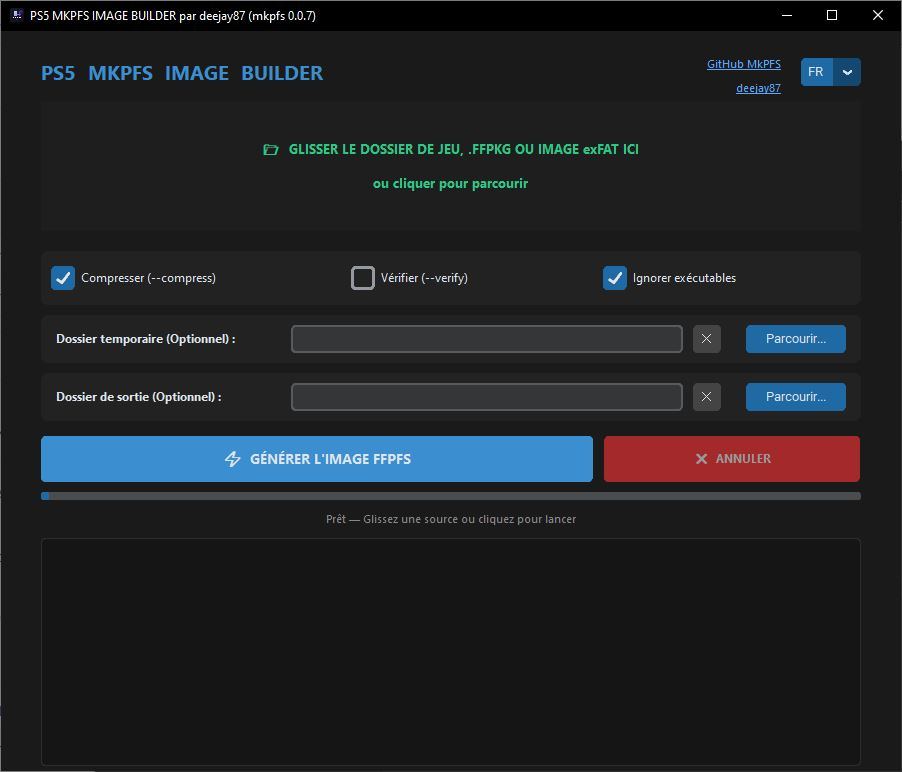

# PS5 MKPFS Image Builder (mkpfs 0.0.7)

Une interface graphique pour packager et compresser des dossiers de jeux, fichiers `.ffpkg` ou `.exfat` au format PFS (`.ffpfs` / `.ffpfsc`) pour la PS5.

Cette application regroupe toutes les fonctionnalités du cœur de l'outil [mkpfs](https://github.com/PSBrew/MkPFS) dans un exécutable portable et autonome.

---

## 📥 Téléchargement

1. Rendez-vous dans la section **[Releases](https://github.com/deejay87/PS5-MKPFS-Image-Builder/releases)** à droite de cette page.
2. Téléchargez la dernière version du fichier `PS5_MKPFS_IMAGE_BUILDER.exe`.
3. Lancez-le directement (aucune installation requise).

---

## 🚀 Fonctionnalités

- **Glisser-Déposer (Drag & Drop) :** Glissez simplement votre dossier de jeu, votre fichier `.ffpkg` ou `.exfat` directement sur la fenêtre, ou cliquez dessus pour charger vos fichiers manuellement.
- **Options de compression :**
  - Compresser les données (`--compress`)
  - Vérifier l'intégrité de l'image créée (`--verify`)
  - Ignorer la compression des exécutables pour accélérer le processus.
- **Dossier temporaire personnalisable (Staging) :** Idéal si vous stockez vos jeux sur un NAS (réseau) ou si votre disque principal `C:` n'a pas assez d'espace libre pour la mémoire tampon.

---

## 📋 Mode d'emploi

1. Lancez l'exécutable.
2. Glissez votre dossier de jeu ou votre fichier .ffpkg ou .exfat source dans la zone grise (ou cliquez dessus pour parcourir vos fichiers).
3. *(Optionnel)* Cochez vos options et choisissez un dossier temporaire sur un disque local rapide si vous travaillez depuis le réseau.
4. Cliquez sur **⚡ GÉNÉRER L'IMAGE FFPFS**.
5. L'image finale sera créée automatiquement au même endroit que votre dossier source.

---

## 💡 Guide simple des options

### 1. La case "Compresser"
* **Option DÉCOCHÉE (Recommandé) :** Le jeu se crée en 2 secondes. Il fait la même taille que l'original, et les temps de chargement sur la PS5 seront ultra-rapides. (Extension `.ffpfs`).
* **Option COCHÉE :** Le jeu sera plus léger sur votre disque dur, mais la création va prendre beaucoup plus de temps. (Extension `.ffpfsc`).

### 2. La case "Ignorer exécutables"
* **🛡️ Laissez cette case cochée.** Elle empêche la compression des fichiers système du jeu. Si vous la décochez, votre jeu risque de faire un écran noir ou de planter au lancement sur la PS5.

### 3. Le "Dossier temporaire"
Quand vous transformez un jeu situé sur un NAS ou un disque externe, le programme doit d'abord faire une copie de travail ultra-rapide en local sur votre PC pour travailler en toute sécurité.

* **Si vous ne touchez à rien (Par défaut) :** Le programme utilise le dossier temporaire caché de Windows (généralement sur votre disque `C:`). Si votre disque `C:` manque de place, le programme risque de bloquer.
* **Si vous choisissez un dossier (Bouton Parcourir) :** Vous pouvez indiquer manuellement un autre disque de votre PC (par exemple un dossier `E:\Temp`) qui possède suffisamment d'espace libre pour accueillir temporairement la copie du jeu. 

*Note : Ce fichier temporaire de travail est automatiquement supprimé et nettoyé par le logiciel dès que la conversion est terminée.*

### 4. Le "Dossier de sortie"
* Choisir l'emplacement ou le fichier `.ffpfsc` ou `.ffpfs` sera enregistré.

### 5. Choix de l'interface (Multilingue)
* Sélectionnez votre langue dans le menu déroulant situé en haut à droite de l'application pour adapter instantanément toute l'interface.

---

### Remarque sur la vitesse de conversion
L'analyse de votre antivirus peut réduire la vitesse de conversion, en particulier durant la phase d'écriture ou lors du traitement de nombreux fichiers individuels. 

Vous pouvez désactiver temporairement la protection en temps réel de votre antivirus pour accélérer le processus. Si vous n'êtes pas sûr, laissez l'antivirus activé et attendez-vous à des conversions plus lentes.

---

## 📸 Screenshot

---

## ⚠️ Notes sur la Stabilité & Bonnes Pratiques

> [!IMPORTANT]
> **Le flux de travail `exfat ➡️ ffpfsc` est la solution fortement recommandée et la plus stable à l'heure actuelle.**

Bien que la conversion directe à partir d'un **dossier de jeu brut (Raw folder)** soit entièrement supportée, elle est encore considérée comme expérimentale et peut rencontrer des limites ou des plantages lors de la gestion de :
* Backups de jeux de très grande taille.
* Dossiers contenant une quantité excessive de fichiers de petite taille (ce qui peut saturer le cache temporaire ou les handles système).

### 💡 Méthode Recommandée
Si vous rencontrez une erreur ou un plantage lors de la compression d'un dossier brut, veuillez d'abord monter ou encapsuler votre dossier de jeu dans une **image exFAT (`.exfat` ou `.img`)**, puis glissez-déposez simplement ce fichier image dans l'application.

---

## 🛡️ Note importante concernant l'Antivirus (Faux Positifs) sur l'utilisation de ce programme

Étant donné que cet exécutable est autonome (packagé sans installateur pour rester portable), **Windows Defender ou votre antivirus habituel peut parfois le bloquer ou le détecter comme une menace (Faux Positif).** 

C'est un comportement classique sur des executables inconnus. 
- Si Windows bloque le lancement, cliquez sur **"Informations complémentaires"** puis sur **"Exécuter quand même"**.
- Si votre antivirus supprime le fichier, vous devez l'ajouter aux **exceptions/exclusions** de votre agent de sécurité.

---

## ⚖️ Crédits

- **Github source de MkPFS :** [MkPFS par l'équipe PSBrewnet](https://github.com/PSBrew/MkPFS)